# 🗺️ Flowchart UX - Landing Page Neivam Carvalho

## Jornada Completa do Usuário

```mermaid
flowchart TD
    START([🌐 Usuário acessa o site]) --> LOADING{⏳ Carregando...}
    
    LOADING -->|< 3s| HERO[🎯 Hero Section<br/>- Foto profissional<br/>- Nome: Neivam Carvalho<br/>- Título: IT Digital Leader & AI Strategist<br/>- Localização: São Paulo, Brasil<br/>- CTA: Entre em Contato]
    
    LOADING -->|> 3s| ERROR[❌ Erro de carregamento<br/>Retry/Reload]
    ERROR --> HERO
    
    %% Hero Section Interactions
    HERO --> HERO_ACTIONS{🎯 Ações na Hero}
    
    HERO_ACTIONS -->|Clique CTA Principal| CONTACT_FORM[📧 Scroll para Contato]
    HERO_ACTIONS -->|Clique LinkedIn| LINKEDIN_EXT[🔗 LinkedIn<br/>Nova aba]
    HERO_ACTIONS -->|Clique GitHub| GITHUB_EXT[🔗 GitHub<br/>Nova aba]
    HERO_ACTIONS -->|Scroll down| NAV_MENU{📋 Menu/Navegação}
    
    %% Navigation Options
    NAV_MENU -->|Sobre| ABOUT_SECTION[👤 Seção Sobre]
    NAV_MENU -->|Expertise| EXPERTISE_SECTION[💼 Áreas de Especialização]
    NAV_MENU -->|Projetos| PROJECTS_SECTION[📁 Projetos em Destaque]
    NAV_MENU -->|Contato| CONTACT_SECTION[📧 Seção de Contato]
    NAV_MENU -->|Scroll natural| EXPERTISE_SECTION
    
    %% About Section
    ABOUT_SECTION --> ABOUT_CONTENT[📄 Bio Profissional<br/>- Experiência em liderança digital<br/>- Foco em transformação tecnológica<br/>- Especialista em BI e IA]
    ABOUT_CONTENT --> ABOUT_ACTIONS{🎯 Ações no Sobre}
    ABOUT_ACTIONS -->|Continue reading| EXPERTISE_SECTION
    ABOUT_ACTIONS -->|Interesse em saber mais| CONTACT_FORM
    
    %% Expertise Section - 5 Tópicos Principais
    EXPERTISE_SECTION --> EXPERTISE_GRID[💼 Grade de Especialidades]
    
    EXPERTISE_GRID --> TOPIC1[🏢 IT Leadership & Management<br/>Liderança de equipes técnicas]
    EXPERTISE_GRID --> TOPIC2[🚀 Digital Transformation<br/>Estratégias digitais e processos]
    EXPERTISE_GRID --> TOPIC3[📊 Business Intelligence & Analytics<br/>Soluções de BI e análise de dados]
    EXPERTISE_GRID --> TOPIC4[🤖 Artificial Intelligence & AI Agents<br/>IA e automação inteligente]
    EXPERTISE_GRID --> TOPIC5[💡 IT Strategy & Innovation<br/>Planejamento estratégico tecnológico]
    
    %% Topic Interactions
    TOPIC1 --> TOPIC_INTEREST{💭 Interesse do usuário}
    TOPIC2 --> TOPIC_INTEREST
    TOPIC3 --> TOPIC_INTEREST
    TOPIC4 --> TOPIC_INTEREST
    TOPIC5 --> TOPIC_INTEREST
    
    TOPIC_INTEREST -->|Alta relevância| CONTACT_IMMEDIATE[📧 Contato imediato]
    TOPIC_INTEREST -->|Quer ver exemplos| PROJECTS_SECTION
    TOPIC_INTEREST -->|Continuar explorando| PROJECTS_SECTION
    
    %% Projects Section
    PROJECTS_SECTION --> PROJECTS_GRID[📁 Grid de Projetos<br/>Máximo 3 projetos featured]
    
    PROJECTS_GRID --> PROJECT1[📄 Projeto A<br/>- Título e descrição<br/>- Tags: Next.js, Tailwind, Vercel<br/>- Link para demo]
    PROJECTS_GRID --> PROJECT2[📄 Projeto B<br/>- Dashboard interativa<br/>- Tags: React, TypeScript, Analytics<br/>- Link para demo]
    PROJECTS_GRID --> PROJECT3[📄 Projeto C<br/>- Landing page SEO<br/>- Tags: Next.js, BI<br/>- Link para demo]
    
    %% Project Interactions
    PROJECT1 --> PROJECT_ACTIONS{🎯 Ações nos Projetos}
    PROJECT2 --> PROJECT_ACTIONS
    PROJECT3 --> PROJECT_ACTIONS
    
    PROJECT_ACTIONS -->|Ver demo| EXTERNAL_DEMO[🌐 Site externo<br/>Nova aba]
    PROJECT_ACTIONS -->|Ver código| GITHUB_REPO[🔗 GitHub repo<br/>Nova aba]
    PROJECT_ACTIONS -->|Interesse comercial| CONTACT_BUSINESS[📧 Contato para projeto similar]
    PROJECT_ACTIONS -->|Scroll down| CONTACT_SECTION
    
    %% Contact Section
    CONTACT_SECTION --> CONTACT_OPTIONS{📧 Opções de Contato}
    
    CONTACT_OPTIONS -->|Email direto| EMAIL_CLIENT[📧 Cliente de email<br/>me@neivamcarvalho.com.br]
    CONTACT_OPTIONS -->|LinkedIn| LINKEDIN_MSG[💼 LinkedIn message]
    CONTACT_OPTIONS -->|Formulário| CONTACT_FORM
    
    %% Contact Form Flow
    CONTACT_FORM --> FORM_FIELDS[📝 Formulário<br/>- Nome *<br/>- Email *<br/>- Assunto<br/>- Mensagem *]
    
    FORM_FIELDS --> FORM_VALIDATION{✅ Validação}
    
    FORM_VALIDATION -->|Campos obrigatórios vazios| FORM_ERROR[❌ Erro de validação<br/>Campos destacados em vermelho]
    FORM_VALIDATION -->|Email inválido| FORM_ERROR
    FORM_VALIDATION -->|Tudo OK| FORM_SUBMIT[📤 Enviando...]
    
    FORM_ERROR --> FORM_FIELDS
    
    FORM_SUBMIT --> SUBMIT_RESULT{📊 Resultado do envio}
    
    SUBMIT_RESULT -->|Sucesso| SUCCESS_MESSAGE[✅ Mensagem enviada!<br/>Resposta em 24h<br/>CTA: Voltar ao topo]
    SUBMIT_RESULT -->|Erro servidor| ERROR_MESSAGE[❌ Erro no envio<br/>Tente novamente ou use email direto]
    SUBMIT_RESULT -->|Rate limit| RATE_LIMIT[⏱️ Muitas tentativas<br/>Aguarde alguns minutos]
    
    %% Success Flows
    SUCCESS_MESSAGE --> SUCCESS_ACTIONS{🎯 Após sucesso}
    SUCCESS_ACTIONS -->|Voltar ao topo| HERO
    SUCCESS_ACTIONS -->|Explorar mais| PROJECTS_SECTION
    SUCCESS_ACTIONS -->|Sair do site| EXIT_SATISFIED[✅ Saída satisfeita]
    
    %% Error Recovery
    ERROR_MESSAGE --> RECOVERY_OPTIONS{🔄 Opções de recuperação}
    RECOVERY_OPTIONS -->|Tentar novamente| FORM_FIELDS
    RECOVERY_OPTIONS -->|Email direto| EMAIL_CLIENT
    RECOVERY_OPTIONS -->|LinkedIn| LINKEDIN_MSG
    
    %% External Link Tracking
    LINKEDIN_EXT --> LINKEDIN_ENGAGEMENT{📊 Engajamento LinkedIn}
    GITHUB_EXT --> GITHUB_ENGAGEMENT{📊 Engajamento GitHub}
    EXTERNAL_DEMO --> DEMO_ENGAGEMENT{📊 Engajamento Demo}
    
    LINKEDIN_ENGAGEMENT -->|Profile view| LINKEDIN_FOLLOW[➕ Possível seguidor]
    LINKEDIN_ENGAGEMENT -->|Direct message| LINKEDIN_LEAD[🎯 Lead qualificado]
    LINKEDIN_ENGAGEMENT -->|Volta ao site| HERO
    
    GITHUB_ENGAGEMENT -->|Repository view| GITHUB_STAR[⭐ Possível estrela]
    GITHUB_ENGAGEMENT -->|Code analysis| GITHUB_INTEREST[👨‍💻 Interesse técnico]
    GITHUB_ENGAGEMENT -->|Volta ao site| PROJECTS_SECTION
    
    DEMO_ENGAGEMENT -->|Impressed| DEMO_INTEREST[😍 Impressionado]
    DEMO_ENGAGEMENT -->|Wants similar| CONTACT_BUSINESS
    DEMO_ENGAGEMENT -->|Volta ao site| PROJECTS_SECTION
    
    %% Mobile Experience Considerations
    HERO -->|Mobile| MOBILE_HERO[📱 Hero mobile<br/>- Stack vertical<br/>- CTAs acessíveis<br/>- Thumb-friendly]
    
    MOBILE_HERO --> MOBILE_NAV{📱 Navegação mobile}
    MOBILE_NAV -->|Hamburger menu| MOBILE_MENU[☰ Menu expansível]
    MOBILE_NAV -->|Scroll| MOBILE_SECTIONS[📱 Seções otimizadas<br/>- Cards empilhados<br/>- Touch targets 44px+]
    
    %% Exit Points and Re-engagement
    HERO --> EXIT_SCENARIOS{🚪 Cenários de saída}
    EXPERTISE_SECTION --> EXIT_SCENARIOS
    PROJECTS_SECTION --> EXIT_SCENARIOS
    
    EXIT_SCENARIOS -->|Bounce rápido| BOUNCE_EXIT[📊 Bounce < 30s<br/>Possível problema de relevância]
    EXIT_SCENARIOS -->|Tempo médio| NORMAL_EXIT[📊 Saída normal 2-5min<br/>Explorou conteúdo]
    EXIT_SCENARIOS -->|Sessão longa| ENGAGED_EXIT[📊 Saída engajada > 5min<br/>Alto interesse]
    
    %% Analytics Events
    HERO --> TRACK_PAGEVIEW[📊 Track: Hero view]
    EXPERTISE_SECTION --> TRACK_EXPERTISE[📊 Track: Expertise view]
    PROJECTS_SECTION --> TRACK_PROJECTS[📊 Track: Projects view]
    CONTACT_FORM --> TRACK_CONTACT[📊 Track: Contact intent]
    SUCCESS_MESSAGE --> TRACK_CONVERSION[📊 Track: Conversion]
    
    %% Performance Considerations
    LOADING -->|Core Web Vitals| PERFORMANCE{⚡ Performance}
    PERFORMANCE -->|LCP < 2.5s| GOOD_PERFORMANCE[✅ Boa performance]
    PERFORMANCE -->|LCP > 2.5s| SLOW_PERFORMANCE[⚠️ Performance ruim]
    
    SLOW_PERFORMANCE --> PERFORMANCE_IMPACT{📊 Impacto na UX}
    PERFORMANCE_IMPACT -->|Alta taxa bounce| OPTIMIZATION_NEEDED[🔧 Otimização necessária]
    PERFORMANCE_IMPACT -->|Usuário aguarda| GOOD_PERFORMANCE
    
    %% Accessibility Considerations
    HERO --> A11Y_CHECK{♿ Acessibilidade}
    A11Y_CHECK -->|Screen reader| SCREEN_READER[🔊 Navegação por áudio]
    A11Y_CHECK -->|Keyboard only| KEYBOARD_NAV[⌨️ Navegação por teclado]
    A11Y_CHECK -->|High contrast| HIGH_CONTRAST[🎨 Modo alto contraste]
    
    %% SEO and Discovery
    START -->|Via Google| SEO_ENTRY[🔍 Entrada via SEO]
    START -->|Via LinkedIn| SOCIAL_ENTRY[📱 Entrada via social]
    START -->|Referral| REFERRAL_ENTRY[🔗 Entrada via referência]
    START -->|Direct| DIRECT_ENTRY[🎯 Entrada direta]
    
    SEO_ENTRY --> SEO_INTENT{🎯 Intenção da busca}
    SEO_INTENT -->|"IT Leader São Paulo"| HIGH_INTENT[🎯 Alta intenção]
    SEO_INTENT -->|"Neivam Carvalho"| BRAND_SEARCH[🏷️ Busca por marca]
    
    HIGH_INTENT --> EXPERTISE_SECTION
    BRAND_SEARCH --> HERO
    
    %% Conversion Funnels
    TRACK_PAGEVIEW --> FUNNEL_TOP[📊 Topo do funil<br/>Awareness]
    TRACK_EXPERTISE --> FUNNEL_MIDDLE[📊 Meio do funil<br/>Consideration]
    TRACK_CONTACT --> FUNNEL_BOTTOM[📊 Fundo do funil<br/>Intent]
    TRACK_CONVERSION --> FUNNEL_CONVERT[📊 Conversão<br/>Action]
    
    %% Styling for better readability
    classDef primaryAction fill:#4CAF50,stroke:#45a049,stroke-width:3px,color:#fff
    classDef userAction fill:#2196F3,stroke:#1976D2,stroke-width:2px,color:#fff
    classDef content fill:#f9f9f9,stroke:#ddd,stroke-width:1px
    classDef analytics fill:#FF9800,stroke:#F57C00,stroke-width:2px,color:#fff
    classDef external fill:#9C27B0,stroke:#7B1FA2,stroke-width:2px,color:#fff
    classDef error fill:#F44336,stroke:#D32F2F,stroke-width:2px,color:#fff
    classDef success fill:#4CAF50,stroke:#388E3C,stroke-width:2px,color:#fff
    
    class CONTACT_FORM,SUCCESS_MESSAGE primaryAction
    class HERO_ACTIONS,TOPIC_INTEREST,PROJECT_ACTIONS userAction
    class HERO,EXPERTISE_GRID,PROJECTS_GRID content
    class TRACK_PAGEVIEW,TRACK_EXPERTISE,TRACK_PROJECTS,TRACK_CONTACT,TRACK_CONVERSION analytics
    class LINKEDIN_EXT,GITHUB_EXT,EXTERNAL_DEMO external
    class FORM_ERROR,ERROR_MESSAGE,BOUNCE_EXIT error
    class SUCCESS_MESSAGE,ENGAGED_EXIT success
```

## 📊 Métricas de UX a Acompanhar

### Engajamento por Seção
- **Hero**: Tempo de permanência, cliques em CTAs
- **Expertise**: Scroll depth, tempo na seção
- **Projetos**: Cliques em demos, visualizações
- **Contato**: Taxa de preenchimento, conversões

### Jornadas Críticas
1. **Visitante → Lead**: Hero → Expertise → Contato
2. **Técnico → Interesse**: Hero → Projetos → GitHub
3. **Recrutador → Contato**: Hero → Expertise → LinkedIn
4. **Cliente → Proposta**: Expertise → Projetos → Contato

### Pontos de Otimização
- **Bounce na Hero** < 40%
- **Scroll até Expertise** > 70%
- **Visualização de Projetos** > 50%
- **Taxa de Contato** > 5%

---

*Flowchart criado para mapear completamente a experiência do usuário na landing page de Neivam Carvalho, considerando todos os cenários de interação, navegação e conversão.*
